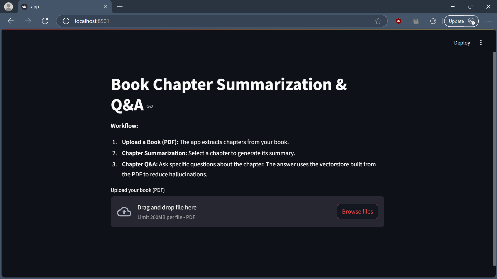
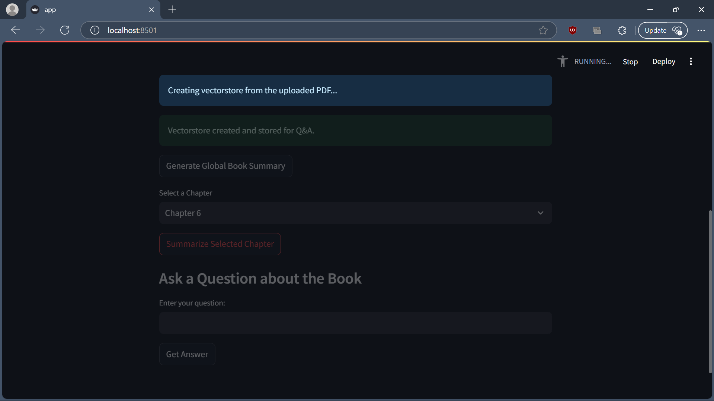
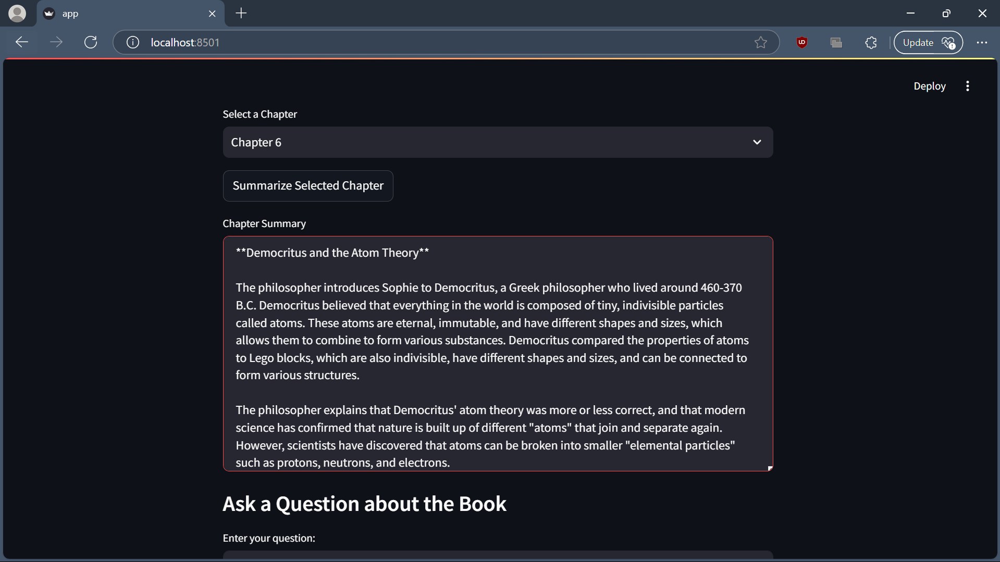
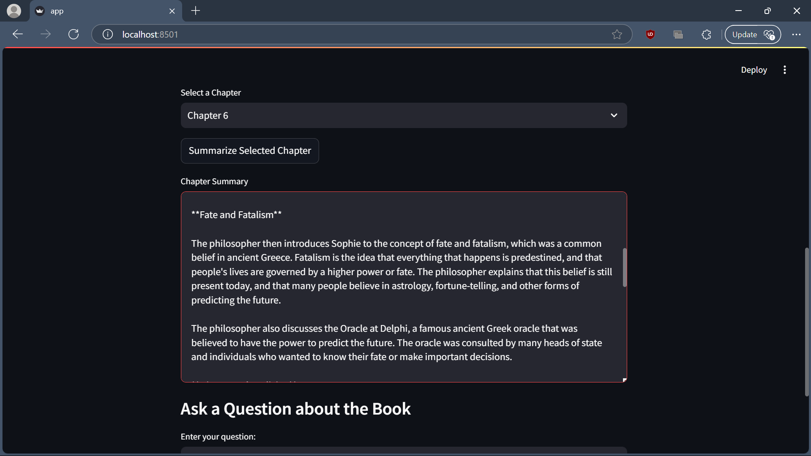
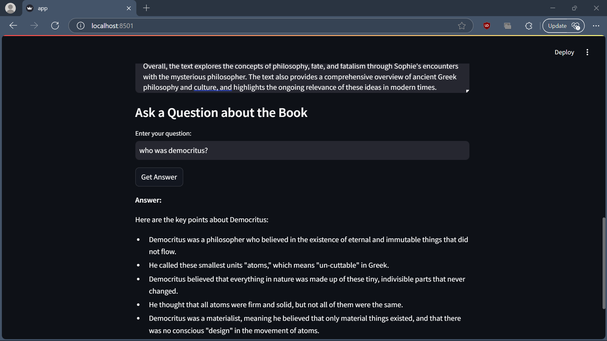

# Book Summarization & Q&A System

This project is a Streamlit-based application designed to help users efficiently digest and understand complex literature. It enables users to upload a book, generate structured summaries, and ask questions using a Retrieval-Augmented Generation (RAG) system.

## Features

- **Chapter-by-Chapter Summarization**  
  Uses LLaMA 3.1 to summarize each chapter, providing a structured breakdown of the book’s content.

- **Retrieval-Augmented Q&A**  
  Implements a Reliable RAG to answer user queries based on the book’s content, ensuring answers are directly sourced from relevant passages.

- **Reliable RAG for Context-Aware Retrieval**  
  Tested semantic chunking, query rewriting, and variable chunk sizing to optimize information retrieval and minimize hallucinations.

- **Local LLM Hosting**  
  All LLMs are hosted locally on a 16GB VRAM setup.

## Tech Stack

- **LLaMA 3.1** for chapter summarization  
- **FAISS + Sentence Transformers** for vector-based retrieval  
- **Streamlit** for user interface  
- **Reliable RAG techniques** (semantic chunking, query rewriting were also tested)  

## Deployment Images

## References

- **llama 3.1**: [Hugging Face](https://huggingface.co/meta-llama/Llama-3.1-8B-Instruct)
- **RAG_Techniques by NirDiamant**: [GitHub](https://github.com/NirDiamant/RAG_Techniques)
---

